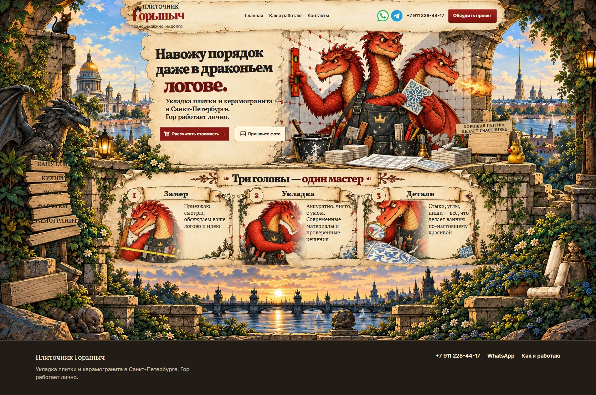

# Плиточник Горыныч

Сказочно-комиксный сайт частного плиточника Георгия в Санкт-Петербурге и Ленинградской области. Визуальный первый этап: хедер, hero с персонажем Гором и блок «Три головы — один мастер».



[Мобильная версия](docs/previews/mobile-v3.webp)

## Состояние проекта

- Публичная главная `/` построена на Next.js 16 и статическом контенте.
- `/admin` сохранён из [OJ CMS](https://github.com/JakuninOleg/OJ-CMS) как демонстрационный интерфейс. В этом стартере ещё нет подключения Payload, базы данных, S3 и серверной авторизации. Демоданные живут в браузере.
- Заявки пока не сохраняются в CMS: кнопки открывают публичные телефон/WhatsApp Георгия из предыдущего проекта; кнопки расчёта и фото подставляют тему обращения в WhatsApp. Перед релизом контакт нужно подтвердить.
- Иллюстрации персонажа и окружения созданы для этого проекта и оптимизированы в WebP. Они не являются фотографиями реальных работ.
- Предыдущий проект [«Свой плиточник»](https://github.com/JakuninOleg/Svoj-plitochnik) использован как источник подтверждённых тем услуг и SEO-гипотез. Новый сайт не копирует его тексты и структуру целиком.

## Локальный запуск

Нужен Node.js 24.

```bash
npm ci
npm run dev
```

Откройте `http://localhost:3000`. Проверки: `npm run lint`, `npm run typecheck`, `npm run build`.

При размещении сайта задайте `NEXT_PUBLIC_SITE_URL` с публичным HTTPS-доменом для абсолютных ссылок Open Graph. На Vercel до подключения собственного домена используется `VERCEL_URL`.

## Документы

- [Арт направление](docs/ART-DIRECTION.md)
- [Контент и SEO](docs/SEO-CONTENT-PLAN.md)
- [Иллюстрации и происхождение](docs/ASSETS.md)

## Следующие этапы

Реальные работы и услуги, интерактивный калькулятор раскладки, проверенная доставка заявки, подключение Payload и выбор хранилищ/хостинга. Админка OJ CMS потребует интеграции с реальным Payload API; текущий интерфейс не следует считать готовым CMS-бэкендом.
